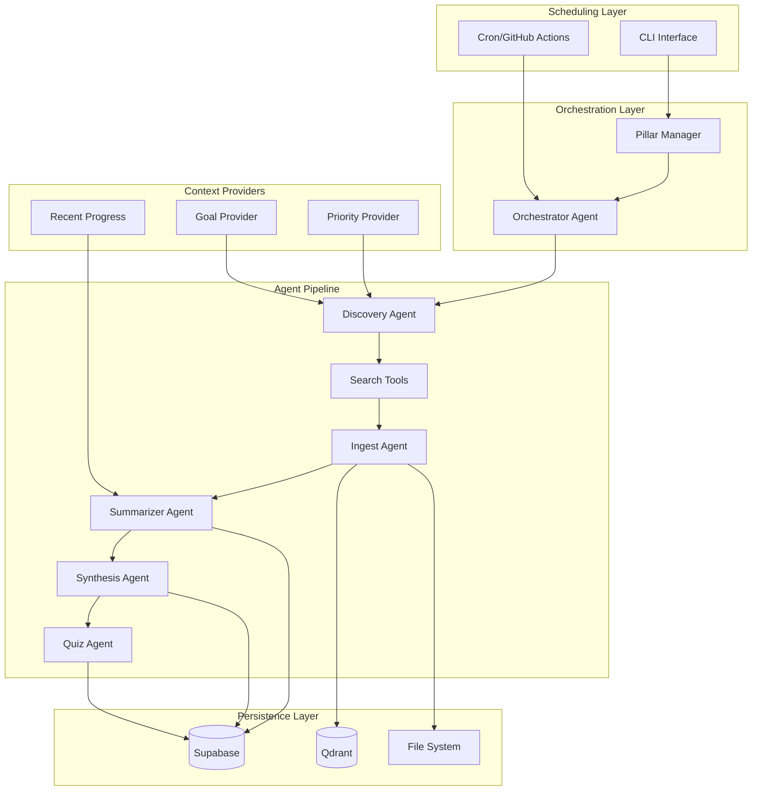

# NLP Learning Workflow - Technical Architecture

## System Architecture Overview



## Component Specifications

### 1. Scheduling Layer

#### Cron/GitHub Actions
- **Purpose**: Automated daily execution
- **Schedule**: Configurable per pillar (default: 8 AM daily)
- **Implementation**:
  ```yaml
  # .github/workflows/daily_learning.yml
  schedule:
    - cron: '0 8 * * *'
  env:
    PILLAR_ROTATION: "P1,P2,P3,P4,P5"
  ```

#### CLI Interface
- **Framework**: Typer
- **Commands**:
  - `run --pillar P1 --papers 2`
  - `status --pillar P1`
  - `review --pillar P1`
  - `pillars list|add|remove`

### 2. Orchestration Layer

#### Orchestrator Agent
- **Responsibility**: Coordinate agent pipeline
- **State Management**: Track pipeline progress
- **Error Handling**: Retry logic, graceful degradation
- **Implementation**:
  ```python
  class Orchestrator:
      def run_pipeline(self, pillar: PillarID, papers_limit: int):
          # Discovery -> Search -> Ingest -> Summarize -> Synthesize -> Quiz
          pass
  ```

#### Pillar Manager
- **Responsibility**: Maintain pillar isolation
- **Features**:
  - Context switching
  - Progress tracking
  - Queue management
- **Data Model**:
  ```python
  class Pillar:
      id: PillarID  # P1-P5
      name: str
      goal: str
      last_run: datetime
      total_papers: int
      queue: List[PaperRef]
  ```

### 3. Agent Specifications

#### Discovery Agent
- **Input**: `PillarGoal, RecentTopics, Priority`
- **Output**: `List[SearchQuery]`
- **Responsibilities**:
  - Generate diverse search queries
  - Avoid recently covered topics
  - Prioritize emerging research
- **Prompt Strategy**:
  ```python
  system_prompt = SystemPromptGenerator(
      background=["Expert in {pillar.name} research trends"],
      steps=[
          "Analyze learning goals and recent progress",
          "Generate 3-5 diverse search queries",
          "Prioritize novel developments"
      ]
  )
  ```

#### Search Tools
- **ArXiv Tool**:
  - Rate limit: 1 request/3 seconds
  - Fields: title, abstract, authors, PDF URL
  - Query format: `cat:cs.CL AND {query}`
  
- **Semantic Scholar Tool**:
  - Rate limit: 100 requests/5 minutes
  - Features: Citation count, influential citations
  - API: `https://api.semanticscholar.org/v1/paper/search`

- **OpenAlex Tool**:
  - Features: Institutional affiliations, funding info
  - Filters: Publication year, open access status

#### Ingest Agent
- **Input**: `PaperRef`
- **Output**: `ParsedPaper`
- **Responsibilities**:
  - Download PDF
  - Extract text (PyPDF2/pdfplumber)
  - Chunk for context windows
  - Extract metadata
- **Implementation**:
  ```python
  class IngestAgent:
      def process(self, paper: PaperRef) -> ParsedPaper:
          pdf_path = self.download_pdf(paper.url_pdf)
          text = self.extract_text(pdf_path)
          chunks = self.chunk_text(text, max_tokens=3000)
          metadata = self.extract_metadata(text)
          return ParsedPaper(text=text, chunks=chunks, metadata=metadata)
  ```

#### Summarizer Agent
- **Input**: `ParsedPaper`
- **Output**: `PaperNote`
- **Schema**:
  ```python
  class PaperNote(BaseModel):
      problem: str  # What problem does this solve?
      method: str   # How does it work?
      findings: List[str]  # Key results
      limitations: List[str]  # What it doesn't do
      future_work: List[str]  # Open questions
      key_terms: List[str]  # Technical vocabulary
  ```
- **Context Providers**: Recent summaries for consistency

#### Synthesis Agent
- **Input**: `PaperNote, PillarContext`
- **Output**: `Lesson, PodcastScript`
- **Responsibilities**:
  - Create digestible lesson
  - Generate practical takeaways
  - Write podcast dialogue
  - Identify related papers
- **Output Schema**:
  ```python
  class Lesson(BaseModel):
      tl_dr: str  # One-sentence summary
      takeaways: List[str]  # 3-5 key points
      practice_ideas: List[str]  # How to apply
      connections: List[str]  # Links to other papers
  ```

#### Quiz Agent
- **Input**: `PaperNote`
- **Output**: `List[QuizCard]`
- **Features**:
  - Multiple difficulty levels
  - Different question types (factual, conceptual, application)
  - Spaced repetition metadata
- **Schema**:
  ```python
  class QuizCard(BaseModel):
      question: str
      answer: str
      difficulty: int  # 1-3
      type: QuestionType  # FACTUAL|CONCEPTUAL|APPLICATION
      # SM-2 fields
      interval: int = 1
      repetitions: int = 0
      ease_factor: float = 2.5
      due_date: datetime
  ```

### 4. Context Providers

#### Recent Progress Provider
- **Data Source**: Last 5 papers from pillar
- **Format**: Condensed summaries
- **Update Frequency**: After each paper processed

#### Goal Provider
- **Data Source**: Pillar configuration
- **Format**: Learning objectives, focus areas
- **Example**: "Focus on transformer alternatives this week"

#### Priority Provider
- **Data Source**: User preferences + trending topics
- **Format**: Ranked list of research areas
- **Update**: Weekly based on community trends

### 5. Data Models

#### Database Schema (Supabase)

```sql
-- Core Tables
CREATE TABLE pillars (
    id VARCHAR(2) PRIMARY KEY,  -- P1-P5
    name VARCHAR(100) NOT NULL,
    goal TEXT,
    created_at TIMESTAMP DEFAULT NOW(),
    last_active TIMESTAMP
);

CREATE TABLE papers (
    id VARCHAR(50) PRIMARY KEY,  -- DOI or arXiv ID
    pillar_id VARCHAR(2) REFERENCES pillars(id),
    title TEXT NOT NULL,
    authors JSONB,
    venue VARCHAR(200),
    year INTEGER,
    url_pdf TEXT,
    added_at TIMESTAMP DEFAULT NOW(),
    processed BOOLEAN DEFAULT FALSE
);

CREATE TABLE notes (
    id UUID PRIMARY KEY DEFAULT gen_random_uuid(),
    paper_id VARCHAR(50) REFERENCES papers(id),
    pillar_id VARCHAR(2) REFERENCES pillars(id),
    problem TEXT,
    method TEXT,
    findings JSONB,
    limitations JSONB,
    future_work JSONB,
    key_terms JSONB,
    created_at TIMESTAMP DEFAULT NOW()
);

CREATE TABLE lessons (
    id UUID PRIMARY KEY DEFAULT gen_random_uuid(),
    paper_id VARCHAR(50) REFERENCES papers(id),
    pillar_id VARCHAR(2) REFERENCES pillars(id),
    tl_dr TEXT,
    takeaways JSONB,
    practice_ideas JSONB,
    connections JSONB,
    podcast_script JSONB,
    created_at TIMESTAMP DEFAULT NOW()
);

CREATE TABLE quiz_cards (
    id UUID PRIMARY KEY DEFAULT gen_random_uuid(),
    paper_id VARCHAR(50) REFERENCES papers(id),
    pillar_id VARCHAR(2) REFERENCES pillars(id),
    question TEXT,
    answer TEXT,
    difficulty INTEGER CHECK (difficulty BETWEEN 1 AND 3),
    question_type VARCHAR(20),
    -- Spaced Repetition fields
    interval INTEGER DEFAULT 1,
    repetitions INTEGER DEFAULT 0,
    ease_factor REAL DEFAULT 2.5,
    due_date TIMESTAMP DEFAULT NOW(),
    last_reviewed TIMESTAMP
);

CREATE TABLE progress (
    id UUID PRIMARY KEY DEFAULT gen_random_uuid(),
    pillar_id VARCHAR(2) REFERENCES pillars(id),
    user_id VARCHAR(100),  -- For future multi-user support
    papers_read INTEGER DEFAULT 0,
    quizzes_completed INTEGER DEFAULT 0,
    current_streak INTEGER DEFAULT 0,
    longest_streak INTEGER DEFAULT 0,
    last_activity TIMESTAMP,
    created_at TIMESTAMP DEFAULT NOW()
);

-- Indexes for performance
CREATE INDEX idx_papers_pillar ON papers(pillar_id);
CREATE INDEX idx_notes_paper ON notes(paper_id);
CREATE INDEX idx_lessons_paper ON lessons(paper_id);
CREATE INDEX idx_quiz_due ON quiz_cards(pillar_id, due_date);
CREATE INDEX idx_progress_user ON progress(user_id, pillar_id);
```

#### Vector Store Schema (Qdrant)

```python
# Collection Configuration
collection_config = {
    "name": "nlp_pillars",
    "vectors": {
        "size": 1536,  # OpenAI embedding dimension
        "distance": "Cosine"
    }
}

# Point Structure
point = {
    "id": "paper_id_chunk_index",
    "vector": [...],  # 1536-dim embedding
    "payload": {
        "pillar_id": "P1",
        "paper_id": "2401.12345",
        "chunk_index": 0,
        "text": "chunk text...",
        "metadata": {
            "title": "Paper Title",
            "authors": ["Author 1", "Author 2"],
            "year": 2024
        }
    }
}

# Namespace Strategy
namespaces = ["P1", "P2", "P3", "P4", "P5"]
```

### 6. API Integrations

#### LLM Provider Configuration
```python
# Multi-provider support
class LLMConfig:
    providers = {
        "openai": {
            "model": "gpt-4o-mini",
            "max_tokens": 4096,
            "temperature": 0.7
        },
        "anthropic": {
            "model": "claude-3-haiku",
            "max_tokens": 4096
        },
        "groq": {
            "model": "mixtral-8x7b",
            "max_tokens": 32768
        }
    }
```

#### Rate Limiting Strategy
```python
class RateLimiter:
    limits = {
        "arxiv": {"requests": 1, "period": 3},  # 1 req/3s
        "semantic_scholar": {"requests": 100, "period": 300},  # 100/5min
        "openai": {"requests": 500, "period": 60},  # 500/min
    }
```

### 7. Error Handling & Recovery

#### Retry Strategy
```python
@retry(
    stop=stop_after_attempt(3),
    wait=wait_exponential(multiplier=1, min=4, max=10),
    retry=retry_if_exception_type(APIError)
)
def call_api(endpoint, params):
    pass
```

#### Fallback Mechanisms
- LLM Provider fallback: OpenAI -> Anthropic -> Groq
- Search fallback: ArXiv -> Semantic Scholar -> Google Scholar
- PDF extraction fallback: PyPDF2 -> pdfplumber -> OCR

### 8. Performance Optimizations

#### Caching Strategy
- Paper PDFs: Local filesystem cache
- API responses: Redis/in-memory cache with TTL
- Embeddings: Stored in Qdrant, never recomputed

#### Batch Processing
- Embed multiple chunks in single API call
- Batch database inserts
- Group quiz card generation

#### Async Operations
```python
async def process_papers(papers: List[PaperRef]):
    tasks = [process_paper(p) for p in papers]
    results = await asyncio.gather(*tasks)
    return results
```

### 9. Monitoring & Logging

#### Metrics to Track
- Papers processed per day
- API costs per pillar
- Error rates by component
- Average processing time
- User engagement (quizzes completed)

#### Logging Configuration
```python
import structlog

logger = structlog.get_logger()
logger = logger.bind(
    pillar_id="P1",
    paper_id="2401.12345",
    component="summarizer"
)
```

### 10. Security Considerations

#### API Key Management
- Environment variables only
- Never in code or config files
- Separate keys for dev/prod
- Regular rotation schedule

#### Data Privacy
- No PII in logs
- Encrypted database connections
- Local PDF storage option
- GDPR compliance ready

### 11. Deployment Architecture

#### Local Development
```bash
# Docker Compose setup
services:
  app:
    build: .
    environment:
      - ENV=development
  postgres:
    image: postgres:15
  qdrant:
    image: qdrant/qdrant
```

#### Production Deployment
- **Application**: Railway/Render/Fly.io
- **Database**: Supabase (managed PostgreSQL)
- **Vector Store**: Qdrant Cloud
- **Scheduler**: GitHub Actions
- **Monitoring**: Sentry/LogRocket

### 12. Testing Strategy

#### Unit Tests
```python
def test_summarizer_agent():
    mock_paper = ParsedPaper(...)
    result = SummarizerAgent.run(mock_paper)
    assert isinstance(result, PaperNote)
    assert len(result.key_terms) > 0
```

#### Integration Tests
- End-to-end pipeline test
- Database transaction tests
- API mock tests

#### Load Testing
- Process 10 papers simultaneously
- Verify rate limit compliance
- Check memory usage

## Appendix: Technology Stack

| Component | Technology | Rationale |
|-----------|------------|-----------|
| Framework | Atomic Agents v2.0 | Modular, typed, composable |
| Language | Python 3.11+ | Async support, type hints |
| Database | Supabase/PostgreSQL | Managed, scalable, free tier |
| Vector DB | Qdrant | Fast, supports namespaces |
| LLM | OpenAI GPT-4o-mini | Cost-effective, reliable |
| PDF Processing | PyPDF2/pdfplumber | Robust text extraction |
| CLI | Typer | Modern, type-safe |
| Testing | pytest | Industry standard |
| Logging | structlog | Structured, queryable |
| Monitoring | Sentry | Error tracking, performance |
